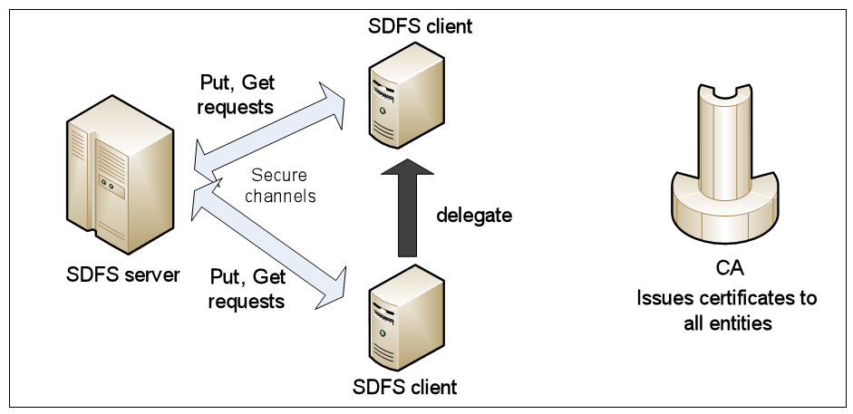

Secure Distributed File System (SDFS)
================================================

CS6238 Secure Computer Systems

Spring 2013

Project 2: Secure Distributed File System (SDFS)

Deadline: 04/26/2013 (11:55pm)

In this project, you will implement a highly simplified but secure distributed file system
(since it is simple, you do not need to worry about directories or path names, also no caching).
This simple *Secure Distributed File Service* (SDFS) stores copies of files created by its users
at remote client machines.
The system consists of multiple SDFS clients and a server that stores files and handles requests
from various clients.
To secure communication between clients and the server, and authenticate sources of requests, we
assume that certificates are available.
Thus, to implement such a system, you will need to set up a CA (Certificate Authority) that
generates certificates for clients and the server.
All nodes trust the CA and have its public key.
You can make use of a library such as **OpenSSL** (see resources section) to implement the CA.

The SDFS client should implement the following calls:

1. **Start-FS-session(<i>server_host, client_cert</i>):**
A client must first start a session with the server before it can store files or retrieve
already stored files.
It provides its certificate to start a new session and specifies the host where the server runs.
At this point, mutual authentication is performed and a secure communication channel is established.
You can  assume that clients have been initialized with information that includes the server certificate.

2. **Get(<i>file UID</i>):**
Once a session is established, a client can request a file (over the secure channel) from the server
using this call.
A request coming over a session is honored only if it is for a file owned by the client that set up the 
session, or this client has a valid delegation (see delegate call).
If successful, the file having unique identifier UID is transferred to the requesting client node over
the secure channel.

3. **Put(<i>file UID</i>):**
The specified file is transferred to the server over the secure channel established when the session was 
initiated.
If the file already exists on the server, you may overwrite it along with its meta-data.
If a new file is put, this client becomes the owner of the file.
If the client is able to update because of a delegation, the owner does not change.

4. **delegate/delegate*(<i>file UID, Client Cert C, time T</i>):**
A delegation credential (e.g., signed token) is generated that allows an owner client to delegate rights
(put, get or both) for a file to another client having certificate C for a time duration of T.
If any confidential information needs to be exchanged between the clients for implementing delegation,
you should use secure channels.
The delegate call is used when the delegated rights should not be propagated further.
The rights could be further delegated when the delegate* call is used.

5. **end-session():** Terminates the current session.

The SDFS server stores data in encrypted form.
It computes an encryption key by hashing the file content.
This key is then encrypted using the server's public key and stored with file meta-data.
When a request comes, the server decrypts the data and sends it back over the secure channel. 

The project deliverables include SDFS code and a report.
In the report, state the protocols that you utilize to implement the interactions between a client
and the server.
In particular, define the message formats for requests-responses and the steps taken to validate
requests and delegation tokens.
You should also perform simple performance evaluation of your system.
For example, times for session setup and transfer of various size files should be included in your report. 

This project should be implemented on Linux/Unix using C/C++/Java for programming and you can work in
groups of two. 
Submissions should be made via t-square by the team-leader/point of contact.
Since this is a security class, you are expected to use static code analysis tools like flawfinder,
and splint (Findbugs, PMD for Java) and minimize the use of unsafe function calls (justify the calls
you make by inline comments).
The report should list tools you used to ensure your code is vulnerability free.

For bonus points, you can also try implementing certificate revocation lists (CRLs).
For example, if the certificate of a server is revoked, what processing must it do to ensure that
the data in its files can be made available to clients in the future?
Explain the details of your CRL implementation (with protocol) in your report.

You will be asked to do a demo to the TA to show that your system implements the required functionality
and works as specified.
However, before the deadline, submit your project as follows.

Deliverables
------------

All in tarball or zip archive:

- The source code along with a Makefile/Ant script. 

- Individual contributions of each member – write about who did what
(function/feature implementation, integration, design, evaluation etc) 

- A README file explaining how to run the program, along with instructions for compiling and
testing your application. 

- A PDF report for your application that includes protocol details and performance evaluation of SDFS.

Resources / Links
-----------------

1. OpenSSL:
http://www.openssl.org/

2. Secure programming with the OpenSSL API:
http://www.ibm.com/developerworks/linux/library/l-openssl.html

3. Java SE Security page:
http://java.sun.com/javase/technologies/security/
